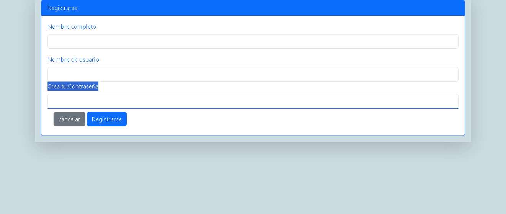
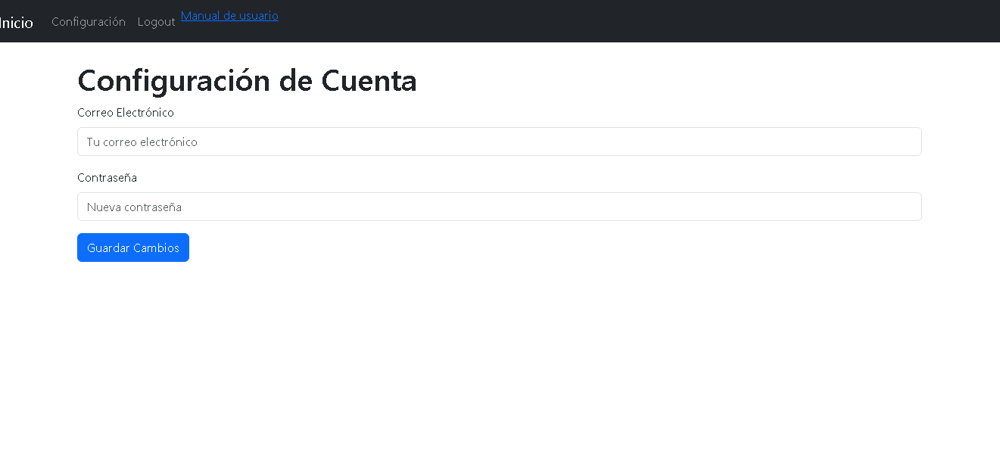

# Manual de Usuario

## Introducción

Bienvenido usuari@ al manual de usuario de nuestra plataforma. Este documento proporcionara una guía detallada sobre cómo deberia navegar y utilizar las diferentes funcionalidades disponibles en esta pagina, para que su servicio sea de la mejor calidad posible. (pasaremos los puntos por orden)

## Contenido

1. [Pagina de Vista](#Vista)
2. [Registro](#lugar-para-registrarse)
3. [Iniciar sesion](#acceso-asu-sesion)
4. [pagina principal](#Pagina-Principal)
5. [Página de productos](#página-de-productos)
6. [Carrito de Compras](#carrito-de-compras)
7. [Planes](#planes)
8. [Contacto](#formulario-de-Contacto-de-página-web)
9. [Descargar Manual](#descargar-manual)

---

## Pagina de Vista
La página de vista es la primera pantalla que se muestra al usuario cuando ingresa a la plataforma.
Tienen informacion general de la pagina web, Quienes somos que servicios ofrece, junto con instrucciones para ingresar y tener las funcionalidades principales y no disponibles en la vista.

## Registro

1. **Acceder a Register**
   - Dirígete a la página de Vistay dirijete a la parte superior y haz clic en el apartado "Register" en la barra de navegación.

2. **registrate**
   - Ingresa tu nombre, usuario y contraseña en los campos correspondientes.
   - Haz clic en el botón "registrase" para crear tu cuenta.

## Inicio de sesion de Usuario

1. **Para iniciar sesion**
   - En la página de inicio, haz clic en el enlace "Login" en la barra de navegación.
   

2. **Completar el Formulario inicio de sesion**
   - Introduce tu nombre junto con tu contraseña.
   - Haz clic en el botón "Log in" para crear una nueva cuenta.

## Página Principal

La página principal de nuestra plataforma ofrece una visión general de las funcionalidades disponibles y acceso a otras secciones importantes simepre y cuando tengas estes registrado en laplataforma.

## Página de Productos

1. **Visualizar Productos**
   - Navega a la sección "Productos" a través del menú de navegación.
   

2. **Detalles del Producto**
   - Se desplegaran los productos de Merchandising con stock, disponibles en ese momento.

## Carrito de Compras

1. **Añadir Productos al Carrito**
   - En la página de productos, selecciona un producto y la cantidad haz clic en "Añadir al carrito".
   

2. **Ver el Carrito**
   - Accede a la sección "Carrito" desde el menú de navegación para revisar los productos añadidos.

3. **Proceder con la Compra**
   - Desde el carrito, puedes proceder al pago o continuar comprando.

## Planes

1. **Visualizar Planes**
   - Navega a la sección "Planes" a través del menú de navegación.
   

2. **Solicitar un Plan**
   - Selecciona el plan de Pagina web que te interesa, cada uno varía dependiendo tus necesidades y el precio.

## Formulario de Solicitud de Página Web

1. **Acceder al Formulario**
   - Ve a la sección de mas abajo en el cual se encuentra un formulario para que puedas contactarte con el vendedor y le epliques de mejor manera tus necesidades, de ahi se procede al pago con transferencia o como se acuerde.
   

2. **Completar el Formulario**
   - Rellena los campos con tus datos personales y las especificaciones de tu solicitud.
   - Haz clic en el botón "Enviar" para enviar tu solicitud.

## Descargar Manual

- en el apartado de Cuenta puedes cambiar tu contraseña y nombre de usuario tambien descargar este manual de usuario

---

Si tienes alguna pregunta o necesitas asistencia adicional, no dudes en ponerte en contacto con nuestro soporte.

**Fecha de última actualización:** [Fecha]

